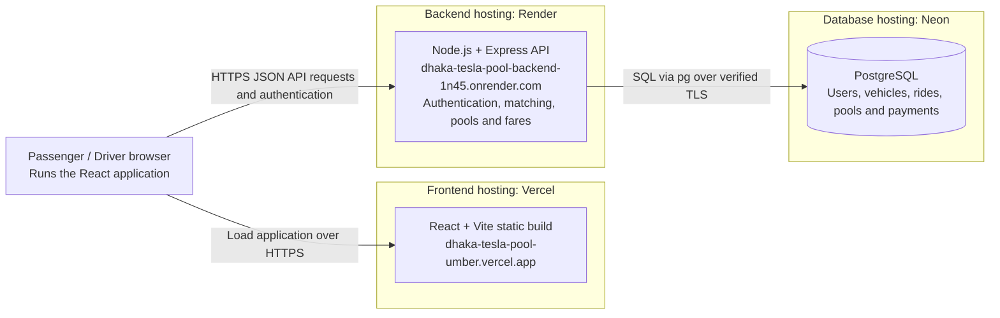
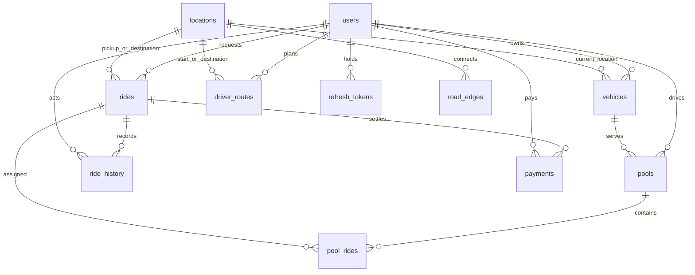

# Dhaka Tesla Pool

**Share a seat. Split the fare. Survive Dhaka traffic.**

A ride-pooling service for Dhaka. Passengers request a ride, drivers run Teslas, and people heading roughly the same way share one car — so everyone pays less than they would alone, and fewer cars are on the road.

---

Live frontend: [Dhaka Tesla Pool](https://dhaka-tesla-pool-umber.vercel.app) | Backend: [Render API](https://dhaka-tesla-pool-backend-1n45.onrender.com) | [Deployment settings](#deployment)


[Screenshots](#screenshots) · [System architecture](#architecture-diagram) · [Database design](#database-diagram) · [Docker setup](#docker-setup)

## ▶ Video walkthrough (6 minutes)

**[](LOOM_VIDEO_URL)**

1. **0:00–1:00** — the problem, the users, and the core idea in my own words
2. **1:00–3:00** — architecture, backend, frontend, database design, the ride/pool
   lifecycle, one key decision, one trade-off, with the architecture diagram and ERD
3. **3:00–6:00** — product tour: passenger flow, driver flow, shared-Tesla pooling,
   fare and status, an edge case, and deployment

- **Video link:** <LOOM_VIDEO_URL>
- **Spoken script and shot list (timed, with on-screen cues):** [VIDEO_SCRIPT.md](VIDEO_SCRIPT.md)
- **[Mermaid ERD](#database-diagram)** and **[architecture diagram](#architecture-diagram)** are embedded below and are shown in the video.

## The Pitch

8:41 AM, Banani Road 11. Jashim is leaning against **Bullet**, his 4-seat Tesla. Nusrat books a ride to Mohakhali. Two minutes later Rafiq books almost the same route to Gulshan 1. The app figures out using the seeded road graph whether they can share a seat, split the fare fairly, and survive the ride. Then Shirin tries to grab the last seat thirty seconds later.

- **Nusrat** pays **210 BDT** initially for Banani -> Mohakhali (8 km), then **170 BDT** when Rafiq joins.
- **Rafiq** pays **95 BDT** for Banani -> Gulshan (3 km): 50 base + 60 distance - 15 pool discount.
- **Shirin** gets the last seat or is told how many seats remain

Jashim just wants to know who's riding and when he can go. Everyone else just wants to get where they're going, pay a fair price, and not accidentally make a new friend.

---

## Demo scenario

| Role | Name | Details |
|------|------|---------|
| Driver | **Jashim** | Owns **Bullet** (4 seats) |
| Passenger | **Nusrat** | Banani → Mohakhali |
| Passenger | **Rafiq** | Banani → Gulshan 1 |
| Passenger | **Shirin** | Late arrival, fights for last seat |

Seeds create locations and roads only. Register these users yourself, or use the restored [demo-account script](backend/scripts/create-demo-accounts.js) against a disposable local database. The script contains public local-demo credentials and creates Jashim, Nusrat, and Rafiq accounts; it does not create Bullet or rides. Use this cast consistently throughout your demo.

---

## Repository Layout

```text
dhaka-tesla-pool/
  backend/                  Express API and PostgreSQL migrations
  frontend/                 React/Vite application
    vercel.json             SPA fallback for normal URLs
  render.yml                Render backend blueprint
  docker-compose.yml        Local PostgreSQL, API, and Nginx frontend
  docs/                     Architecture, database design, and screenshots
  VIDEO_SCRIPT.md           Timed voiceover script for the walkthrough video
  README.md
```

---

## Docker setup

Install Docker with Compose and start Docker Desktop. If `backend/.env` does not exist, copy `backend/.env.example` to it and set two different JWT signing secrets. Keep an existing private `.env` file intact.

From the repository root:

```bash
docker compose up --build
```

Open the frontend at `http://localhost:5173`; the API health endpoint is `http://localhost:8000/health`. Ports 5173, 8000, and 5432 must be available; stop a conflicting local service or change its Compose host-port mapping.

[Backend Dockerfile](backend/Dockerfile) and [frontend Dockerfile](frontend/Dockerfile) use Node 24. Compose runs PostgreSQL 16 with a persistent `postgres_data` volume. The backend runs migrations and location/road seeds before starting. Its container database settings override the hosted database fields in `backend/.env`, with `DB_HOST=postgres` and `DB_SSL=false`.

[Nginx](frontend/nginx.conf) serves the frontend build, forwards `/api/*` to the backend, and supports refreshing normal frontend routes. Compose uses development cookie settings for local HTTP. This setup is separate from the Vercel/Render/Neon deployment.

Compose configuration validation passed after recovery. Container startup still needs verification with Docker running.

---

## Local setup

Prerequisites: Node.js 24 (matching deployment), npm, Git, and a reachable PostgreSQL database. Create the empty database first; migrations create tables, not the database.

### Backend

```bash
cd backend
cp .env.example .env        # Edit DB credentials
npm ci
npm run migrate             # Applies migrations
npm run seed                # Seeds locations + roads
npm run dev                 # :8000 with nodemon
```

### Frontend

```bash
cd frontend
cp .env.example .env.local
npm ci
npm run dev                 # http://localhost:5173
```

**Environment variables** (copy `.env.example` → `.env`):

| Variable | Required | Purpose |
|----------|----------|---------|
| `DB_HOST` | yes | PostgreSQL host |
| `DB_NAME` | yes | Database name (must exist) |
| `DB_USER` | yes | PostgreSQL user |
| `DB_PASSWORD` | yes | PostgreSQL password |
| `DB_SSL` | no | Set `true` for Neon TLS with certificate verification; default `false` for local PostgreSQL. |
| `JWT_ACCESS_SECRET` | yes | Signs access tokens |
| `JWT_REFRESH_SECRET` | yes | Signs refresh tokens |
| `DB_PORT` | no | Default 5432 |
| `PORT` | no | Default 8000 |
| `CORS_ORIGIN` | no | Default `http://localhost:5173` |
| `ACCESS_TOKEN_EXPIRE` | no | Default `15m` |
| `REFRESH_TOKEN_EXPIRE` | no | Default `7d` |
| `NODE_ENV` | no | `development` \| `production` |

> The two signing secrets **must be different**. They sign access/refresh tokens independently; a shared key would let a refresh token be replayed as an access token.

Frontend: set `VITE_API_URL=http://localhost:8000` in `frontend/.env.local`. Vite exposes these variables publicly at build time. The backend reads `backend/.env`, not `backend/.env.local` automatically. It expects separate `DB_*` fields rather than `DATABASE_URL`. On Windows, use `Copy-Item` to copy examples and `npm.cmd` if PowerShell blocks npm.ps1.

For Neon, add your database credentials to `backend/.env` and set `DB_SSL=true`.
This verifies TLS certificates and enables channel binding when offered. Never commit `.env`.

---

## Features

### Passenger (Nusrat, Rafiq, Shirin)

- **Sign up / in** — `POST /auth/register`, `POST /auth/login`
- **Request ride** — Pickup, Destination, Seats (`POST /rides`)
- **See estimated fare** — `NULL` on REQUESTED; computed at match
- **Track status** — Waiting → Matched → In Progress → Completed/Cancelled
- **View history** — All rides with timeline (`GET /history/passenger`)
- **Cancel when valid** — Only while REQUESTED or MATCHED (`PATCH /rides/:id/cancel`)

### Driver (Jashim)

- **Sign in**
- **Go online/offline** — `PATCH /vehicle/status`
- **Own Tesla with fixed capacity** — `POST /vehicle`, `GET /vehicle/me`
- **See relevant requests** — Board shows detour, free seats, fit (`GET /matching/requests`)
- **Accept ride/pool** — `POST /matching/:rideId/accept`
- **Per-passenger arrival and boarding** -- `PATCH /trips/:poolId/rides/:rideId/arrive|start`
- **Cancel one waiting passenger** -- `PATCH /trips/:poolId/rides/:rideId/cancel`; only before arrival for that passenger
- **Complete pool** -- `PATCH /trips/:poolId/complete`; rejects remaining waiting passengers
- **Cancel whole pool** -- `PATCH /trips/:poolId/cancel`; allowed only when no active passenger rides remain
- **See passengers/seats** — Manifest with fares (`GET /pool/:poolId/passengers`)
- **Ride history** — Completed trips with fares (`GET /history/driver`)

### Pool / Ride

- Multiple requests share one Tesla
- Occupied seats never exceed capacity (enforced by `SELECT ... FOR UPDATE`)
- Each passenger gets a fare based on their own distance; all sharing passengers receive the discount, including the first passenger.
- Clear pool membership and lifecycle

### Automatic routes and manual editing

- When no active pool exists, drivers can choose a current location and destination, preview the route, then save it.
- Accepting a ride replaces the displayed manual plan with the shared trip pickup and destination. Manual fields lock, and the backend rejects edits while the pool is active.
- Every additional acceptance updates the pool route. My Tesla, Active Trip, and the acceptance summary show ordered stops and distance. Passengers see the latest shared route on Ride Details.
- The displayed trip pickup is separate from the Tesla's actual location: accepting does not move the vehicle to the pickup. Completion updates the stored vehicle location to the final stop.
- After completion or closing an empty pool, manual editing is available again. Cancelling only one passenger does not unlock a pool with other passengers. Empty active pools remain visible until the driver closes them.
- Arrival and boarding are per passenger. Cancelling a waiting passenger frees only their seats, preserves other rides, and records history. Cancellation after arrival is rejected.

### Loading and refresh behavior

The shared Loading component provides page-specific messages, compact button indicators, and a longer-wait message after eight seconds. useApi reports a timeout after 60 seconds and prevents overlapping polling reloads from replacing pending requests. That timeout does not currently abort the underlying network request.

The request board polls every 10 seconds. My Tesla, active trips, and active passenger ride details poll every 15 seconds while enabled and visible. Route/fare changes appear on the next refresh; this is not WebSocket push. Empty results show **No ride requests yet**, separately from errors.

### Fare Model

`passengerFare = baseFare + distanceCharge - poolDiscount`

- Base fare: **50 BDT per ride request** (not per seat).
- Distance charge: **round(passenger distance in km * 20 BDT)**.
- Pool discount: **round(distanceCharge * 25%)** when at least two distinct passengers share a pool; otherwise zero.
- Each passenger pays for their own shortest pickup-to-destination distance, not the driver's approach or other passengers' detours.
- Adding a second, third, or fourth passenger updates every active ride's stored fare and breakdown in the same transaction as acceptance. The percentage stays 25%; discounts do not stack.
- Once earned, a sharing discount is retained if another passenger cancels. Completed rides and settled payments are not repriced.

**Hand-checkable example using the seeded road network:** Banani -> Gulshan is 3 km; Gulshan -> Mohakhali is 5 km. Use the seeded **Gulshan** location for Rafiq's Gulshan 1 stop.

| Passenger | Own journey | Distance charge | Solo fare | Shared discount | Shared fare |
|---|---|---:|---:|---:|---:|
| Nusrat | Banani -> Gulshan -> Mohakhali (8 km) | 8 * 20 = 160 | 50 + 160 = 210 | 160 * 25% = 40 | **170 BDT** |
| Rafiq | Banani -> Gulshan (3 km) | 3 * 20 = 60 | 50 + 60 = 110 | 60 * 25% = 15 | **95 BDT** |

Accept Nusrat first: her fare is 210. Accept Rafiq into the same pool: Nusrat changes to 170 and Rafiq pays 95. Arrival order does not decide discount eligibility. Passenger Ride Details refresh automatically to show the updated breakdown.

**Money storage:** PostgreSQL INTEGER columns store whole BDT/Taka for rides.fare and payments.amount; fare_breakdown stores the same integer components as JSON. This is not integer poysha or decimal currency. Whole-Taka rounding is an explicit simplification: integer totals avoid fractional rounding drift in stored balances, and every rounded line item adds up exactly. For fractional-Taka pricing, migrate all monetary values consistently to integer poysha (100 per Taka) or fixed-scale NUMERIC; do not mix units.

**Payment:** Cash or simulated TeslaPay wallet (API value TESLA_WALLET). Both record the completed ride's stored fare; no real gateway or wallet transfer is performed.

### Ride Lifecycle

```text
REQUESTED -> MATCHED -> DRIVER_ARRIVED -> ONGOING -> COMPLETED
     |          |
     +----------+----> CANCELLED
```

Passengers cancel only REQUESTED/MATCHED rides. Drivers cancel an assigned passenger only before arrival. Arrival and boarding apply to individual rides; pool-wide completion rejects waiting passengers. A whole pool can be cancelled only when empty. Transactions record ride_history and prevent arrival and cancellation both succeeding for one ride.

---

## Screenshots

These are the original project screenshots restored from Git. They document an earlier UI version: the route-change control, trip actions, and displayed pooled fares may differ from the current implementation described above.

<details>
<summary>Driver: vehicle availability and route planning</summary>


</details>

<details>
<summary>Passenger: request a ride</summary>


</details>

<details>
<summary>Driver: earlier route-change preview</summary>


</details>

<details>
<summary>Driver: shared route and passenger manifest</summary>


</details>

<details>
<summary>Passenger: ride status, fare, route, and timeline</summary>


</details>

The restored [capture script](docs/capture-screenshots.mjs) targets the earlier UI and needs updated selectors before reuse. It creates demo data and advances trip states; use only with a disposable local database.

## Architecture

```
Browser (React + Vite)  →  Node.js API (Express)  →  PostgreSQL
```

### Architecture Diagram


The original image describes the local Docker setup. The diagram below shows the hosted Vercel/Render/Neon setup.



Vercel serves the frontend files; the application running in the browser calls the Render API directly. Render connects to the private Neon database. These are the configured hosting targets; verify the deployed version before recording the walkthrough.

### Database diagram


The original database-design image shows the application tables and their fields. The Mermaid diagram below summarizes their relationships.



The ERD shows database relationships, not an assertion of one successful payment enforced by a unique constraint. Additional tables include token_blacklist and schema_migrations. Pool routes and fare breakdowns use JSONB.

The original diagrams are stored at [docs/system-architecture.png](docs/system-architecture.png) and [docs/database-design.png](docs/database-design.png).

### Tech stack

React 19, React Router 7, Vite 8, Tailwind CSS 4, Node.js 24, Express 5, PostgreSQL (pg), Zod, bcrypt, and JWT.

### Backend Structure

```
backend/src/
├── app.js                 # Express app, middleware, route mounting
├── server.js              # Boots app, checks DB first
├── config/env.js          # Env config, fails fast when incomplete
├── database/
│   ├── db.js              # Pooled pg client
│   ├── migrate.js         # Migration runner (tracks applied files)
│   ├── migrations/up|down # Numbered SQL, applied in order
│   └── seeds/             # Locations + roads (no accounts)
├── middleware/            # auth, role, validate, asyncHandler, errors
├── modules/               # One folder per feature
│   ├── auth/              # register, login, refresh, logout
│   ├── users/             # profile
│   ├── vehicles/          # Tesla registration and status
│   ├── location/          # Dhaka locations
│   ├── graph/             # road graph, Dijkstra
│   ├── rides/             # requests, cancellation, state machine
│   ├── matching/          # ranking, accept flow, seat claiming
│   ├── pools/             # route optimiser, pooling, manifest
│   ├── trips/             # arrive, start, complete
│   ├── routes/            # driver route planning
│   ├── history/           # passenger and driver history
│   ├── payment/           # settlement
│   └── fare/              # fare model
└── utils/                 # AppError, response helpers
```

Each module keeps its own `*.service.js`, `*.repository.js`, `*.routes.js`, `*.validation.js`. Controllers handle HTTP, services hold rules, repositories own SQL.

### Frontend Structure

```
frontend/src/
├── api/client.js          # Single fetch() call site; auth, refresh, envelope
├── components/
│   ├── ui/                # Reusable primitives including Loading (Button, Input, Select…)
│   ├── layout/            # AppShell, Navbar, PageContainer
│   ├── driver/            # RequestCard, PassengerManifest
│   └── ride/              # FareBreakdown, RoutePath, RoutePreview
├── context/AuthProvider.jsx
├── hooks/useApi.js, useAuth.js
├── lib/format.js, constants.js
├── pages/
│   ├── auth/              # LoginPage, RegisterPage
│   ├── passenger/         # RequestRide, MyRides, RideDetail, JoinPool, Payments, History
│   └── driver/            # MyTesla, Requests, ActiveTrip, History
├── routes/                # AppRoutes, ProtectedRoute, RoleRoute
└── services/              # One file per backend module (URL building only)
```

---

## API Reference

Base URL: `http://localhost:8000`  
Response envelope: `{ "success": boolean, "message": string, "data": ... }`  
Auth: `Authorization: Bearer <accessToken>` (access tokens 15 min; refresh token httpOnly cookie, 7 days)

### Auth

| Method | Path | Access | Purpose |
|--------|------|--------|---------|
| POST | `/auth/register` | public | Create account |
| POST | `/auth/login` | public | Sign in, sets refresh cookie |
| POST | `/auth/refresh-token` | cookie | Mint new access token |
| POST | `/auth/logout` | authenticated | Revoke current token |

### Users

| Method | Path | Access | Purpose |
|--------|------|--------|---------|
| GET | `/users/me` | authenticated | Own profile |
| PATCH | `/users/me` | authenticated | Update own profile |

### Vehicles (Driver)

| Method | Path | Access | Purpose |
|--------|------|--------|---------|
| POST | `/vehicle` | DRIVER | Register Tesla |
| GET | `/vehicle/me` | DRIVER | Own Tesla |
| PATCH | `/vehicle/status` | DRIVER | Go online/offline |
| PATCH | `/vehicle/:id` | DRIVER | Update Tesla (own only) |

### Rides (Passenger)

| Method | Path | Access | Purpose |
|--------|------|--------|---------|
| POST | `/rides` | PASSENGER | Request a ride |
| GET | `/rides/my` | PASSENGER | Own rides, including shared_route, pool_id, route_updated_at |
| GET | `/rides/:id/history` | owner or driver | Full lifecycle trail |
| PATCH | `/rides/:id/cancel` | PASSENGER (owner) | Cancel before driver arrival |

### Matching (Driver)

| Method | Path | Access | Purpose |
|--------|------|--------|---------|
| GET | `/matching/requests` | DRIVER | Open requests with detour/fit |
| POST | `/matching/:rideId/accept` | DRIVER | Accept with own Tesla |
| POST | `/matching/:rideId` | DRIVER | Auto-match, best Tesla wins |

### Pools

| Method | Path | Access | Purpose |
|--------|------|--------|---------|
| POST | `/pool/:poolId/add-passenger` | PASSENGER (own ride) | Join existing Tesla |
| GET | `/pool/:poolId/passengers` | DRIVER (own pool) | Passenger manifest |

### Trips (Driver)

| Method | Path | Access | Purpose |
|--------|------|--------|---------|
| GET | `/trips/my-active` | DRIVER | Current trip |
| PATCH | `/trips/:poolId/rides/:rideId/arrive` | DRIVER (own pool) | Arrive for one passenger |
| PATCH | `/trips/:poolId/rides/:rideId/start` | DRIVER (own pool) | Board one passenger |
| PATCH | `/trips/:poolId/rides/:rideId/cancel` | DRIVER (own pool) | Cancel one passenger before arrival |
| PATCH | `/trips/:poolId/cancel` | DRIVER (own pool) | Close an empty pool |
| PATCH | `/trips/:poolId/complete` | DRIVER (own pool) | Finish |

Legacy pool-wide arrive/start endpoints return 409: use individual passenger actions.

### Driver route planning

| Method | Path | Access | Purpose |
|---|---|---|---|
| POST | /driver-routes/preview | DRIVER | Calculate without saving |
| POST | /driver-routes | DRIVER | Save currentLocationId and destinationLocationId; current location optional |
| GET | /driver-routes/me | DRIVER | Active shared route or applicable manual plan; includes locked |

### History, Payments, Locations

| Method | Path | Access | Purpose |
|--------|------|--------|---------|
| GET | `/history/passenger` | PASSENGER | Ride history |
| GET | `/history/driver` | DRIVER | Trip history |
| POST | `/payments/:rideId` | PASSENGER (own ride) | Pay for completed ride |
| GET | `/payments/my` | PASSENGER | Payment history |
| GET | `/location` | public | All locations |
| GET | `/location/:id` | public | One location |
| GET | `/health` | public | Liveness + DB round-trip |

> Drivers poll `/matching/requests` and `/trips/my-active`. No WebSocket/push.

---

## Matching & Routing

Eight seeded zones: Banani, Gulshan, Mohakhali, Dhanmondi, Mirpur, Uttara, Farmgate, Bashundhara. Dijkstra calculates shortest paths.

- First acceptance: any reachable passenger route is allowed for an online Tesla with capacity; the driver's saved destination does not restrict it.
- Later acceptances: compare the proposed pool route with the current route. Extra distance must be at most 5 km, with sufficient seats.
- The board prioritizes takeable requests, then shorter detours and older requests. Sharing a pickup does not automatically guarantee compatibility.
- Each board calculation loads the road graph once and reuses it. A controlled ten-request example dropped road-data reads from 310 to 1 with identical results; this is not a live latency guarantee.
- The route display is an ordered sequence of stops, not live GPS navigation.

---

## Capacity enforcement

Driver acceptance locks the Tesla row before checking or creating its active pool, then rechecks allocated seats in the transaction. Direct passenger joins lock the existing pool before checking seats. Requests that exceed remaining capacity are rejected with a conflict response. The first pool requires a vehicle lock because its pool row does not exist yet.

These protections do not replace regression testing of all competing API paths; see the limitations below.

---

## Authentication

- **Access token** — JWT, 15 min, stored in **memory only** (never localStorage)
- **Refresh token** — httpOnly cookie, 7 days, `SameSite=None; Secure` in production, `SameSite=Lax` in development
- **Auto-refresh** — On 401, client calls `/auth/refresh-token` once, retries original request
- **Logout** — Clears memory + revokes refresh token + blacklists access token until expiry

> No localStorage for access tokens. On page refresh, a fresh access token is acquired via the httpOnly refresh cookie.

---

## Database Schema (Key Tables)

| Table | Purpose |
|-------|---------|
| `users` | id, name, email, password_hash, role |
| `vehicles` | id, driver_id, model, capacity, current_location_id, status |
| `rides` | id, passenger_id, pickup/destination_location_id, seats, status, fare, fare_breakdown, timestamps |
| `pools` | id, vehicle_id, driver_id, status, capacity, current_route (JSONB) |
| `pool_rides` | pool_id, ride_id, seats_allocated |
| `payments` | id, ride_id, passenger_id, amount, method, status |
| `ride_history` | ride_id, actor_id, action, created_at |
| `locations` | id, name (8 Dhaka zones) |
| `road_edges` | from_location_id, to_location_id, distance_km |

---

## Git Workflow

The hosting workflow uses `pre-release`. Commit application changes and lockfiles, push the intended branch, then check that Render and Vercel deployed that commit successfully. Never commit private .env files or credentials.

---

## Testing & Concurrency

From frontend:

```bash
npm run build
npm run lint
```

Neither package defines an npm test script. Development used one-off checks against temporary local database schemas that were removed afterward. Checks covered route preview/save, four sequential acceptances and shared-route visibility, per-passenger cancellation and seat release, ownership, arrival/cancellation races, empty-pool closure, location locking, completion updates, and first-passenger fare repricing through both acceptance paths. These are not a committed regression suite or proof that the current hosted commit contains every change.

Manual demo:
1. Register Jashim, Nusrat, and Rafiq; create Bullet with four seats and put it online.
2. Preview and save a manual route.
3. Accept Nusrat's Banani-to-Mohakhali ride: fare 210, route fields locked.
4. Accept Rafiq's Banani-to-Gulshan ride: Nusrat becomes 170, Rafiq 95; both see the current shared route after polling.
5. Mark Nusrat arrived/onboard. Her cancellation must fail; Rafiq can still be cancelled individually without changing Nusrat's status.
6. Complete the remaining trip, check the vehicle's final location, and record a Cash or simulated TeslaPay payment.
7. In a separate trip cancel the last waiting passenger, close the empty pool, and edit the next route.
8. Open and refresh a normal frontend URL directly; verify loading, empty, and error states.

---

## Deployment

### Hosted URLs

| Component | Platform | Address |
|---|---|---|
| Frontend | Vercel | [Open app](https://dhaka-tesla-pool-umber.vercel.app) |
| Backend | Render | [API](https://dhaka-tesla-pool-backend-1n45.onrender.com) |
| Health | Render + DB check | [Health](https://dhaka-tesla-pool-backend-1n45.onrender.com/health) |
| Public data | Render | [Locations](https://dhaka-tesla-pool-backend-1n45.onrender.com/location) |
| Database | Neon PostgreSQL | Private credentials configured on Render |

This README describes the repository, not a guarantee of which commit is currently live.

### Render

[render.yml](render.yml) defines root directory backend, Node 24, build command npm ci, start command npm start, and health path /health. Connect pre-release and configure private DB_HOST, DB_NAME, DB_USER, DB_PASSWORD, JWT_ACCESS_SECRET and JWT_REFRESH_SECRET in Render.

```env
NODE_ENV=production
DB_PORT=5432
DB_SSL=true
CORS_ORIGIN=https://dhaka-tesla-pool-umber.vercel.app
```

Render supplies PORT. A local .env edit does not update hosted settings. Neon TLS certificate verification stays enabled. Do not publish the database connection string.

### Vercel

| Setting | Value |
|---|---|
| Production branch used | pre-release |
| Root directory | frontend |
| Framework | Vite |
| Node version | 24 |
| Install command | npm ci |
| Build command | npm run build |
| Output directory | dist |

Set the Production environment variable, then redeploy:

```env
VITE_API_URL=https://dhaka-tesla-pool-backend-1n45.onrender.com
```

Use the backend root without /api or a trailing slash. Vite embeds this value at build time. [frontend/vercel.json](frontend/vercel.json) rewrites frontend routes to /index.html, supporting normal URLs such as /login and /my-rides/1. This fallback is not an API proxy. Unknown routes show the React not-found page.

A Vercel preview URL is a different origin. Requests from it need that exact origin in Render's comma-separated CORS_ORIGIN; use the main domain for the public demo. Do not use a wildcard for credentialed requests.

### Migrations and release verification

For a new database, run npm run migrate and npm run seed from backend using the intended database credentials. These are separate from Render's build/start commands. Seeds create reference locations/roads, not users. npm run migrate:down rolls back the latest migration and can remove data; use only against an intended development database. Recent route, cancellation, and fare changes need no new migration. Do not restore the database just to deploy code.

After pushing, verify both hosts deployed the intended commit. Check /health, a direct frontend page refresh, login, and one passenger/driver flow.

### Troubleshooting

- Frontend route 404: check root directory frontend and that the deployed commit includes vercel.json.
- Cannot fetch data: inspect the failing browser Network request, actual frontend origin, API URL, CORS headers, and backend health.
- Refresh token missing before login: expected when there is no saved session; inspect the login request separately.
- Session lost after refresh: check production cookie settings and browser third-party-cookie restrictions. A same-origin API proxy or shared-site domains would avoid that cross-site limitation.
- npm ci failure: synchronize and commit package.json and package-lock.json.
- Empty requests: show No ride requests yet; an empty list is not a loading failure.

---

## Trade-offs & Limitations

- Seeded zones and stop sequences keep routing explainable; there is no live GPS, traffic, weather pricing, or map navigation.
- Polling is simple but updates take up to the next 10-15 second refresh. WebSockets or server-sent events are future options.
- Whole-Taka fares and retained earned discounts are deliberate demo policies; fractional pricing requires a money-unit migration.
- Payments simulate settlement, not actual transfers. Add a database uniqueness constraint for one successful payment per ride before relying on concurrent payments.
- Locks protect seat claims and trip actions, but do not imply every API path is concurrency-safe. Add durable regression coverage for duplicate acceptance, passenger cancellation races, simultaneous route changes and joins, and payments.
- UI request timeouts do not abort server work; add cancellation and server-side time limits.
- Refresh tokens are stored as text; rotation and expiry cleanup are absent. Rate limiting, password reset, email verification, signing-key-strength checks, and consistent configurable expiry metadata remain improvements.
- Refresh the restored screenshots for the current UI, add reproducible integration tests and deployment smoke checks, and verify the restored Docker setup end to end.

---

## AI Usage

- **Codex:** frontend polish, reusable Loading and route components, deployment configuration, bug fixes, route/cancellation/fare changes, verification, and documentation updates.
- **ChatGPT:** implementation questions, bug-fixing guidance, and project documentation.

**Accepted suggestion:** reuse a road-graph snapshot within each request-board calculation. This removed repeated database round trips while checks confirmed unchanged matching results.

**Changed suggestion:** hash-based routing initially avoided hosting rewrites, but was replaced by BrowserRouter and a Vercel SPA fallback so production URLs remain clean and refresh correctly.

AI assistance was checked against the code and database behavior. Engineering understanding means explaining ownership checks, state transitions, transactional updates, fare units, and deployment trade-offs, rather than minimizing AI usage.
