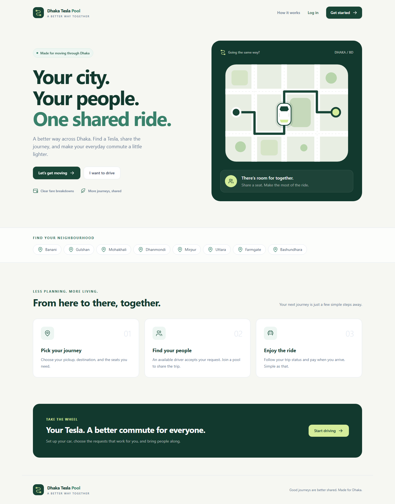
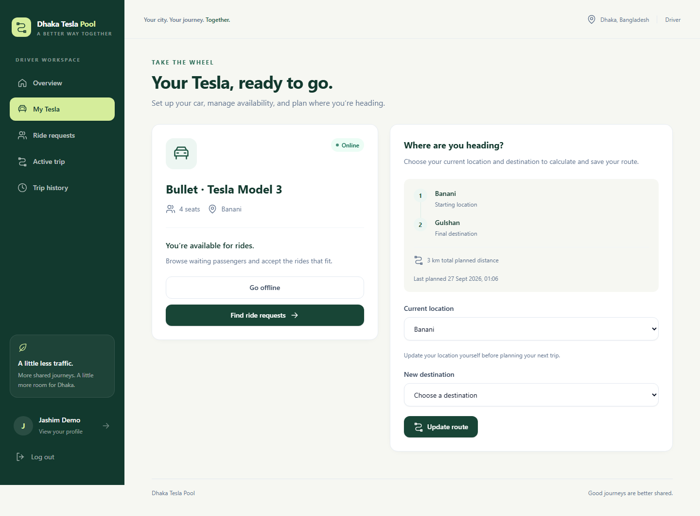
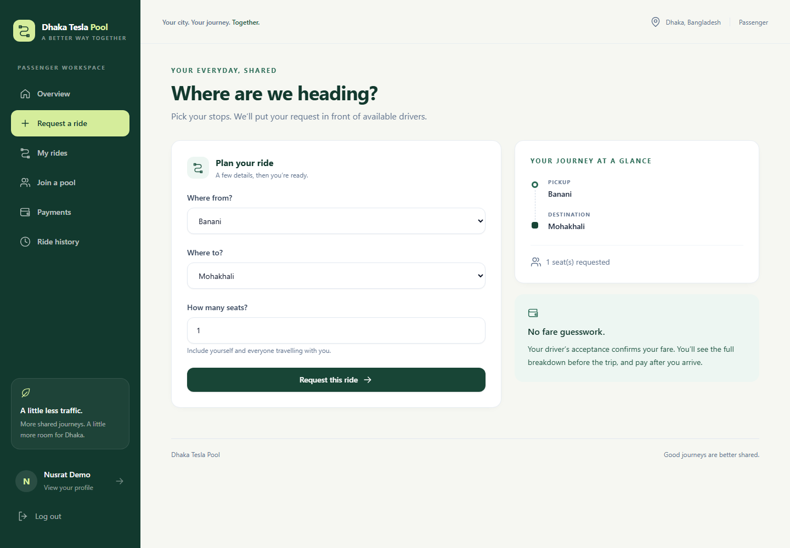
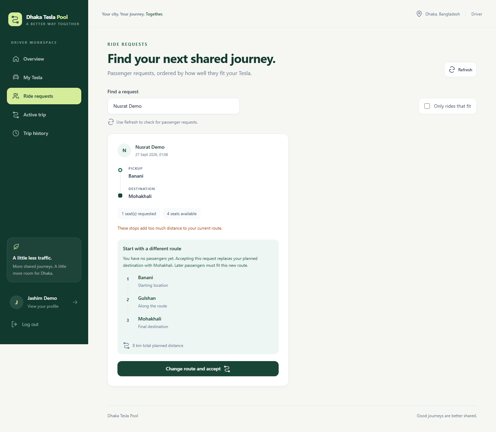
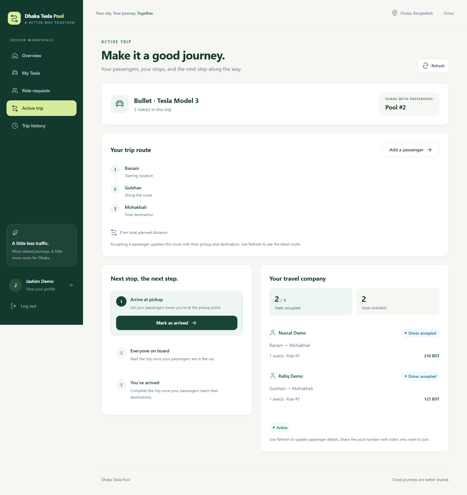
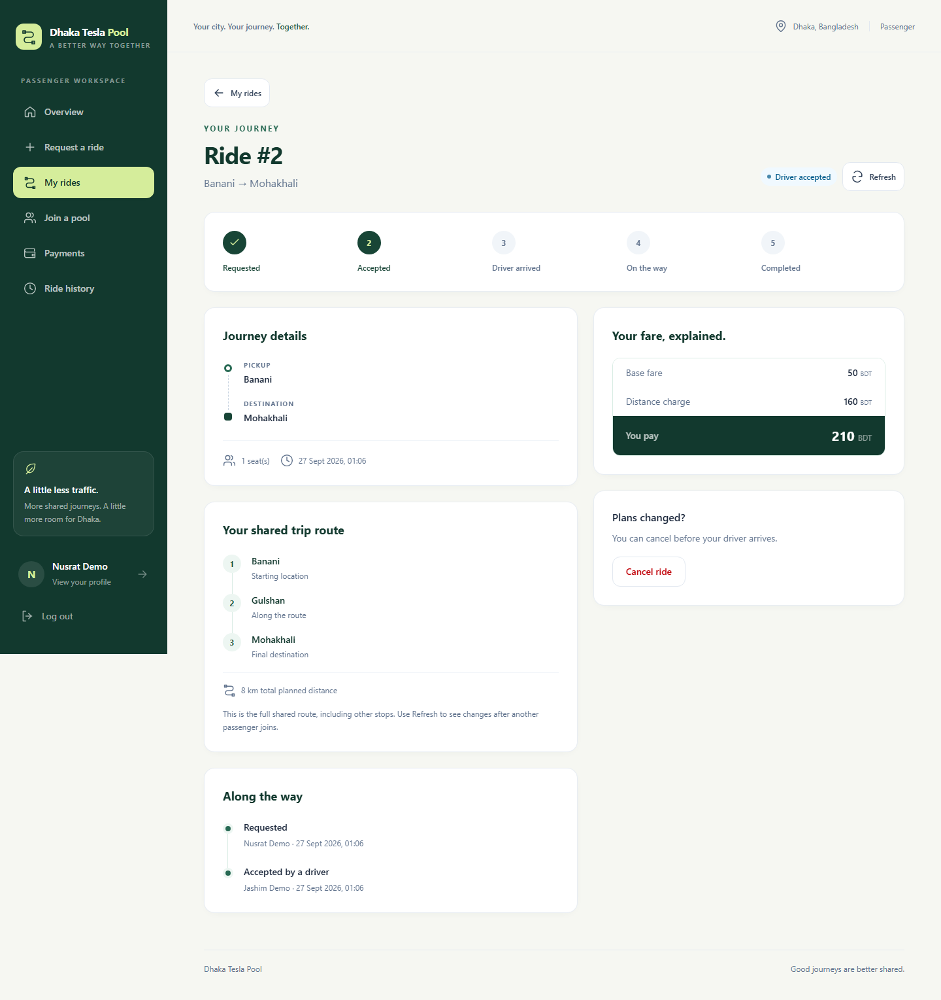
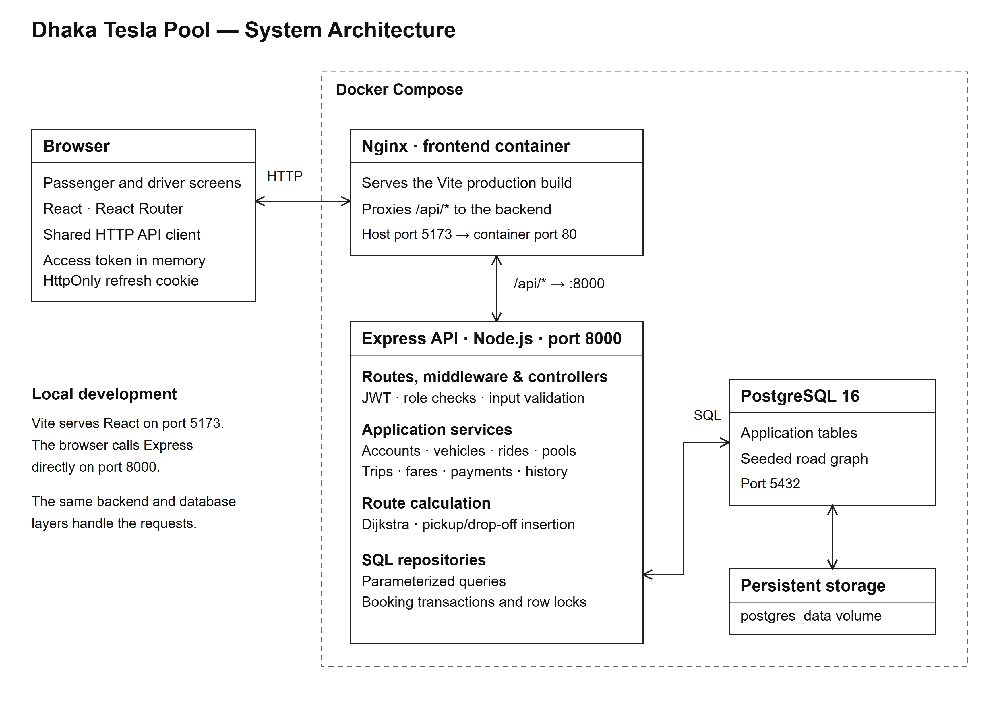
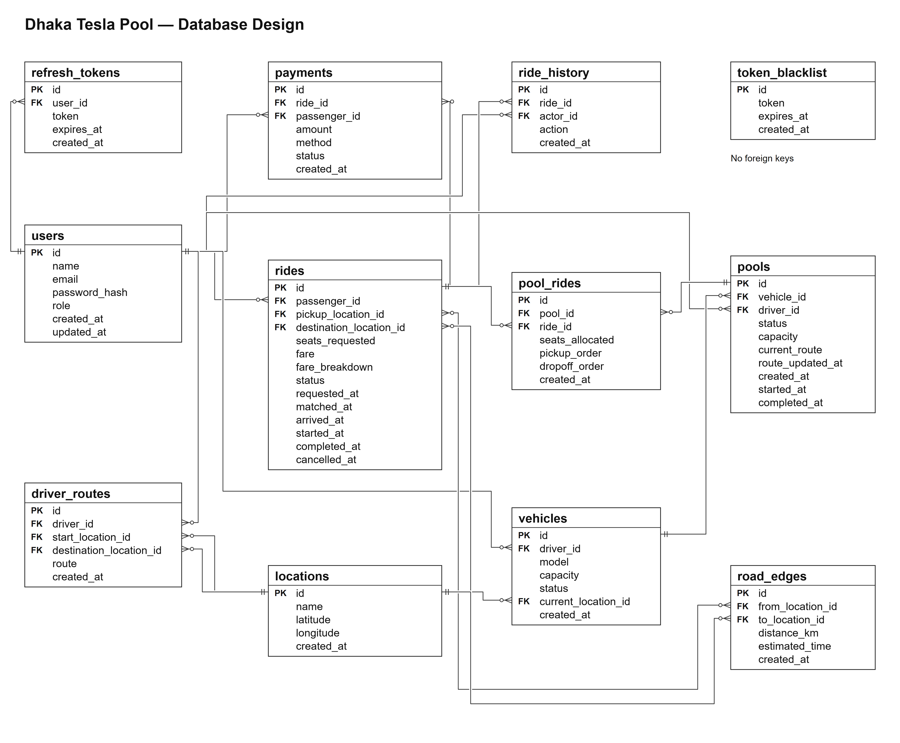

# Dhaka Tesla Pool

Dhaka Tesla Pool is a full-stack ride-pooling MVP for passengers and drivers travelling between predefined Dhaka locations. Passengers request seats, drivers accept compatible journeys, and the application calculates a shared route, tracks trip stages, explains each fare, and records a simulated payment after completion.

The project demonstrates graph-based routing, pickup/drop-off insertion, role-based access, PostgreSQL transactions, and a responsive React interface. Vehicle registration is a local application feature; there is no Tesla vehicle API integration.



## Contents

- [Problem statement](#problem-statement)
- [Features implemented](#features-implemented)
- [Screenshots](#screenshots)
- [Architecture](#architecture)
- [Database design](#database-design)
- [Tech stack](#tech-stack)
- [Project structure](#project-structure)
- [Prerequisites](#prerequisites)
- [Environment variables](#environment-variables)
- [Local setup](#local-setup)
- [Docker setup](#docker-setup)
- [Migrations and seeds](#migrations-and-seeds)
- [Demo credentials and walkthrough](#demo-credentials-and-walkthrough)
- [Deployment and hosting](#deployment-and-hosting)
- [API overview](#api-overview)
- [Key decisions and trade-offs](#key-decisions-and-trade-offs)
- [Known limitations](#known-limitations)
- [Next improvements](#next-improvements)
- [AI Usage](#ai-usage)

The [frontend documentation](frontend/README.md) explains the client implementation, and the API overview below summarises the endpoint groups.

## Problem statement

A driver with spare seats and passengers travelling in a similar direction need a way to coordinate a shared journey. Assigning passengers by availability alone can produce excessive detours, overbooked vehicles, unclear fares, and inconsistent trip states.

This project models that problem using a small road graph of Dhaka. A booking must fit the vehicle's capacity and route, preserve pickup-before-drop-off ordering, and expose a clear progression from request to completion. Drivers and passengers see their own workflows, while the backend owns routing, authorization, fares, and persisted state.

## Features implemented

| Area | Implemented behavior |
| --- | --- |
| Accounts | Register as `PASSENGER` or `DRIVER`, log in/out, restore sessions, and update name/email. Passwords use bcrypt; protected endpoints use JWT and role checks. |
| Passenger requests | Choose pickup/destination from seeded locations, request a positive number of seats, list rides, inspect a ride's route/fare/timeline, and cancel before driver arrival. |
| Driver vehicle | Register one vehicle through the normal application flow, edit its details, set current location, and switch online/offline. |
| Driver route planning | Calculate and save a route from a selected current location to a destination. Planning a replacement route is blocked while a pool is active. |
| Matching | Show drivers waiting requests with seat availability and route compatibility. Drivers can accept a specific request; a separate API endpoint supports automatic candidate ranking. |
| First-passenger route change | The driver can accept any reachable first passenger's route with enough available seats, using **Change route and accept** when it does not fit the original plan. From the second passenger onward, acceptance depends on the extra distance compared with the current shared route. |
| Pooling | Insert pickup/drop-off stops, enforce the 2 km incremental detour rule, and check seats in a database transaction. Passengers can also join an existing pool using its number. |
| Trip management | Driver actions move eligible rides through arrival, start, and completion. The active-trip screen includes a passenger manifest, occupancy, and full shared route. |
| Fares | Store and display base fare, distance charge, pool discount, and total to the poisha. The pool's driven route is priced segment by segment; a segment shared by several riders is split between them, and a booking of several seats claims several seats' share of that road. |
| Payments and history | Record `CASH` or `TESLA_WALLET` as a simulated payment for a completed ride; view payment records, passenger history, and completed driver trips. |
| Interface | Responsive role-specific navigation, shared controls, search/filtering, loading/error/empty states, password visibility, action confirmations, and manual Refresh controls. |
| Operations | Database-aware health endpoint, SQL migrations, repeatable reference-data seeds, Docker Compose, and unit/integration test scripts. |

The normal ride lifecycle is:

```text
REQUESTED -> MATCHED -> DRIVER_ARRIVED -> ONGOING -> COMPLETED
    |           |
    +-----------+-----> CANCELLED
```

Cancellation is available only in `REQUESTED` or `MATCHED`. Creating a request does not automatically dispatch a driver. An acceptance or explicit pool join confirms the fare and assignment.

### Fares

A passenger's fare follows one rule:

```text
passenger fare = base fare + distance charge - pool discount
```

What changed is what `distance charge` is measured against. A pool is priced segment by segment along the route the driver actually drives, and each segment is paid for by whoever is in the car while it is driven:

- A segment with one rider aboard is charged to that rider in full.
- A segment with several riders aboard is split between them. A booking of several seats claims several seats' share of that road, so two seats pays double the one-seat share.
- The driver's drive to the first pickup carries nobody and is billed to no one.
- Money carries to the poisha (1 BDT = 100 poisha) and all arithmetic runs in integer poisha, so a segment shared three ways is 33.34 / 33.33 / 33.33 and the shares still sum to 100.00. Fares are stored as `NUMERIC(10,2)`.

The 25% pool discount is earned per rider and only by a rider who shared at least one segment. It comes off that rider's own road charge, never the base fare, so the base still covers the driver's fixed cost of making the trip. A rider who travels a private leg the whole way shares nothing and pays the full rate.

Because a rider's share depends on who else is in the car, **every rider in a pool is repriced whenever its membership or route changes**. A fare is not locked at match time: the moment a second passenger is accepted, the first passenger's fare moves too, because the two of them now share road. Adding a passenger can also lengthen the road an existing passenger travels, and that is billed to whoever is aboard for it rather than dumped on one person.

### Passenger and driver capabilities

| Passenger | Driver |
| --- | --- |
| Register and log in; restore a session | Register and log in; register and edit one vehicle |
| Request a ride with pickup, destination, and seats | Go online/offline and set the current location |
| See the estimated fare once matched | Plan and save a route; browse compatible waiting requests |
| Track status through to completion or cancellation | Accept a request, with or without changing the route |
| Join an existing pool by pool number | View the passenger manifest and seat occupancy |
| Cancel while `REQUESTED` or `MATCHED` | Mark arrival, start, and completion in order |
| Record a payment and review ride history | Review completed trips and plan the next route |

### First request versus later requests

For the **first ride request accepted into a new pool**, the driver can choose any reachable pickup and destination, provided the vehicle has enough seats. If the request does not fit the driver's original plan, **Change route and accept** explicitly replaces that plan with a route serving the first passenger. The original plan's 2 km detour limit does not prevent this explicit replacement.

For the **second and each later ride request**, the backend inserts the new passenger's pickup and drop-off into the current shared route and compares the total distances:

```text
Extra distance = proposed shared-route distance - current shared-route distance
```

| Distance difference | Acceptance |
| --- | --- |
| At most 2 km | Allowed if enough seats are available and a valid route exists. |
| More than 2 km | Rejected because the new passenger adds too much travel distance. |

For example, if the current shared route is **8 km**, a second request producing a **10 km** route adds **2 km** and can be accepted. A request producing an **11 km** route adds **3 km** and is rejected. This compares the full shared route, not just the new passenger's individual travel distance.

After each acceptance, the updated route becomes the baseline for the next request. The driver cannot use **Change route and accept** to bypass this limit once a pool is active.

## Screenshots

These images are supplied in [`docs/screenshots`](docs/screenshots). They show the local demo flow; ride and pool IDs depend on the database contents. Still screenshots are included; there is no GIF asset in the repository.

### Demo video

Watch the screen recording of the full passenger and driver flow:

**[Open the demo video](https://drive.google.com/file/d/1Zle0fdd8ffFGGupJ43HypJAF6fygyr68/view?usp=sharing)**

<iframe
  src="https://drive.google.com/file/d/1Zle0fdd8ffFGGupJ43HypJAF6fygyr68/preview"
  width="800"
  height="450"
  frameborder="0"
  allow="accelerometer; autoplay; clipboard-write; encrypted-media; gyroscope; picture-in-picture"
  allowfullscreen>
</iframe>

<details>
<summary>Driver: vehicle availability and route planning</summary>



</details>

<details>
<summary>Passenger: request a ride</summary>



</details>

<details>
<summary>Driver: preview a route change before accepting the first passenger</summary>



</details>

<details>
<summary>Driver: shared route, passenger manifest, and trip actions</summary>



</details>

<details>
<summary>Passenger: ride status, fare breakdown, route, and timeline</summary>



</details>

Before running the supplied capture script, note that it creates demo data and advances a trip: see [demo credentials and walkthrough](#demo-credentials-and-walkthrough).

## Architecture



In local development, Vite serves the frontend on port `5173`, and the browser calls Express on port `8000`. In Docker, Nginx serves the built frontend and forwards `/api/*` to `backend:8000`, stripping `/api`. For example, browser request `/api/auth/login` becomes backend request `/auth/login`.

When hosted, the two tiers are split across providers: the built frontend is a static site on **Vercel** and the Express API is a Node web service on **Render**, so the browser calls the API's absolute `VITE_API_URL` across origins instead of using the Nginx `/api` proxy. The database is **Neon** PostgreSQL, reached over TLS. See [deployment and hosting](#deployment-and-hosting).

Backend modules follow `route -> middleware -> controller -> service -> repository -> PostgreSQL`. Middleware handles authentication, roles, and request-body validation; services implement business rules; repositories contain parameterized SQL. The graph and fare modules are internal services rather than public endpoints.

The frontend uses React context for authentication, service files for endpoint calls, and one shared HTTP client for bearer tokens, cookies, response parsing, and one refresh/retry after an expired access token. Access tokens stay in memory; refresh tokens use an HttpOnly cookie. Screens load data on entry and refresh after actions or when the user selects Refresh.

## Database design



The supplied ERD shows the 12 application tables. The migration runner also creates `schema_migrations` to track applied SQL files.

| Tables | Responsibility |
| --- | --- |
| `users`, `vehicles` | Account roles and driver vehicle details. The service checks for an existing vehicle before registration. |
| `locations`, `road_edges` | Named locations and weighted road links used to build an undirected graph. |
| `driver_routes` | Saved driver plans, including JSONB path and distance. |
| `rides` | Passenger requests, seats, status timestamps, integer fare, and JSONB fare breakdown. |
| `pools`, `pool_rides` | Vehicle/driver journeys and passenger assignments; route snapshots and allocated seats. |
| `ride_history` | Lifecycle events and the user responsible for each event. |
| `payments` | Recorded payment amount, method, and status for a passenger's ride. |
| `refresh_tokens`, `token_blacklist` | Stored refresh sessions and revoked token records. |

Relationships are enforced with foreign keys. `pool_rides` is the pool-to-ride association; `(pool_id, ride_id)` is unique. This does **not** enforce that a ride can belong to only one pool across concurrent requests. Additional integrity gaps are documented under [known limitations](#known-limitations).

## Tech stack

Versions below describe the repository's package declarations and Docker images.

| Layer | Technologies |
| --- | --- |
| Frontend | JavaScript ES modules, React 19.2, React Router 7, Vite 8.3, Tailwind CSS 4.3 |
| Backend | Node.js, CommonJS JavaScript, Express 5.2, `pg` 8.23 |
| Validation and auth | Zod 4.6, bcrypt 6, jsonwebtoken 9, cookie-parser, CORS |
| Persistence | PostgreSQL 16, handwritten SQL migrations, JSONB route/fare snapshots |
| Linting | ESLint 10, `eslint-plugin-react-hooks`, `eslint-plugin-react-refresh` |
| Containers | Docker Compose, Node 24 Alpine images, PostgreSQL 16 Alpine, Nginx Alpine |
| Hosting | Vercel (frontend), Render (backend), Neon (PostgreSQL) |

The application uses browser `fetch` and local UI components. There is no ORM, external mapping service, payment gateway, or Tesla SDK in the dependency list.

## Project structure

```text
dhaka-tesla-pool/
|-- README.md                       Project overview and operating guide
|-- docker-compose.yml              PostgreSQL, backend, frontend services
|-- render.yml                      Render Blueprint for the hosted backend API
|-- backend/
|   |-- .env.example                Safe configuration template
|   |-- Dockerfile                  Migrate, seed, then start the API
|   |-- package.json                Backend commands and dependencies
|   |-- scripts/
|   |   `-- create-demo-accounts.js  Local demo account registration
|   `-- src/
|       |-- app.js                  Express routes and middleware
|       |-- server.js               DB check and HTTP listener
|       |-- config/env.js           Environment loading and required checks
|       |-- database/               Connection, migration runner, and seeds
|       |   |-- migrations/up/      12 forward SQL migrations
|       |   |-- migrations/down/    12 matching rollback SQL files
|       |   `-- seeds/              Locations and road-edge reference data
|       |-- middleware/             Auth, roles, validation, error handling
|       |-- modules/
|       |   |-- auth/ users/ vehicles/ location/
|       |   |-- graph/              Dijkstra and the in-memory road graph
|       |   |-- routes/ rides/ matching/ pools/
|       |   |-- trips/ fare/ payment/ history/
|       `-- utils/                  Error and response helpers
|-- frontend/
|   |-- .env.example                Public API base URL template
|   |-- Dockerfile                  Vite build and Nginx runtime
|   |-- nginx.conf                  SPA fallback and /api proxy
|   |-- vercel.json                 Vercel SPA fallback rewrite
|   `-- src/
|       |-- api/                    Shared fetch client and response parser
|       |-- context/                Auth provider and context
|       |-- routes/                 Route table and access guards
|       |-- pages/                  Public, auth, passenger, driver, account
|       |-- components/
|       |   |-- ui/                 Buttons, inputs, cards, states
|       |   |-- layout/             Shell, navbar, dashboard, containers
|       |   |-- ride/               Route, fare, and history presentation
|       |   `-- driver/             Request card and passenger manifest
|       |-- hooks/                  Data loading, polling, and auth hooks
|       |-- services/               Backend endpoint adapters
|       `-- lib/                    Formatting and enum constants
`-- docs/
    |-- system-architecture.png
    |-- database-design.png
    |-- screenshots/                Six application screenshots
    `-- capture-screenshots.mjs      Local screenshot automation
```

## Prerequisites

- For local development: Node.js and npm, PostgreSQL 16, and Git. Node 24 is the version used for the checks below. The locked frontend tools require Node `20.19+`, `22.13+`, or `24+` on their respective supported major lines; the backend alone declares `>=20`.
- For the full container setup: Docker with the Compose plugin and a running engine. Host Node/PostgreSQL installations are unnecessary unless running host-side utility scripts or tests.
- Available ports: `5173` for the frontend, `8000` for the API, and `5432` for PostgreSQL. Vite fails if `5173` is occupied.
- For optional screenshot capture: Node 22.13+ or Node 24, Chrome/Edge, and the Docker-style `/api` proxy described in the technical reference.

## Environment variables

Use [`backend/.env.example`](backend/.env.example) and [`frontend/.env.example`](frontend/.env.example). Commit the examples only. Real `.env` and `.env.local` files are ignored by Git. No real secrets are included in this documentation.

### Backend: `backend/.env`

| Variable | Example/default | Purpose |
| --- | --- | --- |
| `NODE_ENV` | `development` | `production` enables the Secure refresh cookie and suppresses error stacks in responses. |
| `PORT` | `8000` | Local backend listening port. Compose fixes the internal port at `8000`. |
| `CORS_ORIGIN` | `http://localhost:5173` | Allowed browser origin; comma-separate multiple origins. |
| `DB_HOST` | `localhost` | Host-run backend database host; Compose overrides it to `postgres`. On Neon use the pooler host, for example `ep-xxxx-pooler.c-xx.aws.neon.tech`. Required. |
| `DB_PORT` | `5432` | Database port. Set explicitly as in the template. |
| `DB_NAME` | `tesla_pool` | Existing database name. On Neon this is usually `neondb`. Required. |
| `DB_USER` | `postgres` | Database user. Required. |
| `DB_PASSWORD` | `postgres` | Local demonstration password only; replace for deployment. Required. |
| `DB_SSL` | `false` | Set `true` for Neon TLS with certificate verification. `render.yml` sets this for the hosted API. |
| `JWT_ACCESS_SECRET` | `change-me-to-a-long-random-string` | Access-token signing key. Required; replace the placeholder. |
| `JWT_REFRESH_SECRET` | `change-me-to-a-different-long-random-string` | Separate refresh-token signing key. Required; replace the placeholder. |
| `ACCESS_TOKEN_EXPIRE` | `15m` | Access JWT lifetime; defaults to `15m` if omitted. |
| `REFRESH_TOKEN_EXPIRE` | `7d` | Refresh JWT lifetime; defaults to `7d` if omitted. |

Generate each signing key separately and paste the values into your uncommitted environment file:

```sh
node -e "console.log(require('crypto').randomBytes(48).toString('hex'))"
```

The boot-time check validates the presence of required values, not their strength or whether the two signing keys differ. Cookie and token-record expiry durations contain fixed 7-day/15-minute values; changing JWT lifetimes alone does not update those durations.

### Frontend: `frontend/.env.local`

| Variable | Local value | Docker build value | Vercel value |
| --- | --- | --- | --- |
| `VITE_API_URL` | `http://localhost:8000` | `/api` | `https://dhaka-tesla-pool-backend-1n45.onrender.com` |

Vite embeds this value in the browser bundle at build time. Never place secrets in `VITE_*` variables. The Dockerfile sets `/api` explicitly and does not copy `.env.local`; changing a runtime container variable will not change the built frontend. On Vercel the value is a dashboard environment variable, so it must be set before the build and a change requires a redeploy. See [deployment and hosting](#deployment-and-hosting).

`DEMO_API_URL` optionally overrides the demo script's default `http://localhost:8000`, but the script accepts only localhost/loopback hosts. `CHROME_PATH` optionally selects the screenshot script's browser executable. Neither is required by the application.

## Local setup

Run from a checked-out copy of this repository. The steps below use a locally installed PostgreSQL server.

### 1. Create configuration files

PowerShell, from the repository root (existing local files are preserved):

```powershell
if (!(Test-Path backend/.env)) { Copy-Item backend/.env.example backend/.env }
if (!(Test-Path frontend/.env.local)) { Copy-Item frontend/.env.example frontend/.env.local }
```

Bash alternative:

```bash
test -f backend/.env || cp backend/.env.example backend/.env
test -f frontend/.env.local || cp frontend/.env.example frontend/.env.local
```

**Environment variables** (copy `.env.example` → `.env`):

| Variable | Required | Purpose |
|----------|----------|---------|
| `DB_HOST` | yes | PostgreSQL host |
| `DB_NAME` | yes | Database name (must exist) |
| `DB_USER` | yes | PostgreSQL user |
| `DB_PASSWORD` | yes | PostgreSQL password |
| `DB_SSL` | no | Set `true` for Neon TLS with certificate verification; default `false` for local PostgreSQL. |
| `JWT_ACCESS_SECRET` | yes | Signs access tokens |
| `JWT_REFRESH_SECRET` | yes | Signs refresh tokens |
| `DB_PORT` | no | Default 5432 |
| `PORT` | no | Default 8000 |
| `CORS_ORIGIN` | no | Default `http://localhost:5173` |
| `ACCESS_TOKEN_EXPIRE` | no | Default `15m` |
| `REFRESH_TOKEN_EXPIRE` | no | Default `7d` |
| `NODE_ENV` | no | `development` \| `production` |

> The two signing secrets **must be different**. They sign access/refresh tokens independently; a shared key would let a refresh token be replayed as an access token.

For Neon, add your database credentials to `backend/.env` and set `DB_SSL=true`.
This verifies TLS certificates and enables channel binding when offered. Never commit `.env`. The same `DB_*` values are what the hosted API on Render reads, so a local `.env` pointed at Neon exercises the production database path.

---

### 2. Create the database

With PostgreSQL running, create the database if it does not already exist:

```sh
createdb -h localhost -p 5432 -U postgres tesla_pool
```

Use the user/database names from your environment file if different. If `createdb` is not on PATH, use PostgreSQL's command-line tools or create `tesla_pool` through your database client. Migrations create tables inside the database; they do not create the database itself.

### 3. Install and run the backend

In terminal 1, from the repository root:

```sh
cd backend
npm ci
npm run migrate
npm run seed
npm run dev
```

The API is available at [localhost:8000](http://localhost:8000). [GET /health](http://localhost:8000/health) performs a real database query. Use `npm start` instead of `npm run dev` to run without Nodemon; neither command automatically migrates or seeds outside Docker.

### 4. Install and run the frontend

In terminal 2, from the repository root:

```sh
cd frontend
npm ci
npm run dev
```

Open [localhost:5173](http://localhost:5173). On Windows, use `npm.cmd` if PowerShell blocks the `npm.ps1` launcher.

For a local production-build check, run `npm run build`, then `npm run preview -- --port 5173` from `frontend/` after stopping Vite. Reusing port `5173` keeps the default backend CORS origin valid. Vite preview does not provide the Docker Nginx `/api` proxy, so use the direct backend URL for this build.

## Docker setup

Create `backend/.env` from its example as above and set the JWT keys. Then, from the repository root:

```sh
docker compose up --build -d
docker compose ps
docker compose logs --tail=100 backend
```

| Service | Local access | Container behavior |
| --- | --- | --- |
| Frontend | [http://localhost:5173](http://localhost:5173) | Nginx serves the Vite build on port 80. |
| API via frontend | [http://localhost:5173/api/health](http://localhost:5173/api/health) | Nginx strips `/api` and forwards to Express. |
| API directly | [http://localhost:8000/health](http://localhost:8000/health) | Express listens on container port 8000. |
| Database | `localhost:5432` | PostgreSQL 16 with the named `postgres_data` volume. |

PostgreSQL must pass its health check before the backend starts. The backend startup command runs pending migrations, seeds the reference graph, then starts Express. The frontend waits for the backend health check. Source code is copied into images, so code changes require rebuilding.

**Compose environment distinction:** `env_file: ./backend/.env` supplies backend auth/CORS values, but Compose explicitly overrides database values with `${DB_*}` substitutions and defaults. Plain `docker compose up` therefore uses the default database name/user/password unless those variables are supplied to Compose through the shell or a root `.env`. To use the database values from `backend/.env` for interpolation too, use:

```sh
docker compose --env-file backend/.env up --build -d
```

Use the same `--env-file backend/.env` option consistently for subsequent Compose commands when choosing this form. Compose still uses `DB_HOST=postgres` internally. An existing database volume retains its original PostgreSQL user/password; changing environment variables does not reset that database.

Useful commands:

```sh
docker compose logs --tail=100 frontend backend postgres
docker compose exec backend npm run migrate
docker compose exec backend npm run seed
docker compose down
```

`docker compose down` retains the database volume. Adding `--volumes` deletes the stored database and should be used only for an intentional disposable-data reset.

## Migrations and seeds

Run these commands from `backend/` for local development:

| Command | Effect |
| --- | --- |
| `npm run migrate` | Applies unapplied `src/database/migrations/up/*.sql` files in filename order, in individual transactions. |
| `npm run migrate:down` | Rolls back one most recently applied migration using its matching down file. This can drop a table and its data. |
| `npm run seed` | Inserts reference locations and road edges; creates no users, vehicles, bookings, or payments. |
| `npm run demo:accounts` | Registers the three local demo accounts through the running API. |

`schema_migrations` records filenames, so rerunning migration-up skips applied files. Editing an already-applied file will not update an existing database; add a new migration for schema changes. The numbering gap at `007` is harmless because the runner discovers files rather than requiring consecutive numbers.

The seed contains **8 locations** (Banani, Gulshan, Mohakhali, Dhanmondi, Mirpur, Uttara, Farmgate, Bashundhara) and **10 road-edge rows**. Each edge is traversable in both directions in the in-memory graph. Distances are demonstration weights, not measured traffic-aware distances. Sequential reruns skip existing records; there is no database uniqueness constraint protecting road edges against concurrent seed runs.

## Demo credentials and walkthrough

These are deliberately public, local-only accounts defined in [`create-demo-accounts.js`](backend/scripts/create-demo-accounts.js), not production credentials. They exist only after running the script or registering them manually. With the API running on port `8000`, run from the repository root:

```sh
node backend/scripts/create-demo-accounts.js
```

Or run `npm run demo:accounts` from `backend/`. Existing accounts remain unchanged, including their passwords.

| Role | Name | Email | Password |
| --- | --- | --- | --- |
| Driver | Demo Driver | `driver@example.test` | `DemoRide2026!` |
| Passenger | Passenger One | `passenger1@example.test` | `DemoRide2026!` |
| Passenger | Passenger Two | `passenger2@example.test` | `DemoRide2026!` |

The `example.test` domain is reserved for documentation and cannot receive mail, so these accounts cannot be targeted by a real message. To use different credentials, edit `DEMO_ACCOUNTS` in the script and re-run it.

For a Docker-only machine without host Node, the image does not include `scripts/`. Copy and run the standalone registration script in the running backend container:

```sh
docker compose cp backend/scripts/create-demo-accounts.js backend:/tmp/create-demo-accounts.js
docker compose exec backend node /tmp/create-demo-accounts.js
```

Use separate browser profiles or a normal/private window for the driver and passenger; tabs in the same profile share the refresh cookie. Sign out between the two passenger accounts if using one passenger window.

1. Sign in as the driver. In **My Tesla**, register a vehicle such as `Bullet`, capacity `4`, current location **Banani**, and go online.
2. Plan **Banani -> Gulshan**. The seeded graph gives a 3 km route.
3. Sign in as Passenger One and request **Banani -> Mohakhali**, one seat.
4. As the driver, open **Ride requests** and select **Refresh**. The request exceeds the original route's 2 km detour limit. Choose **Change route and accept** to explicitly replace the unused plan with **Banani -> Gulshan -> Mohakhali**, 8 km.
5. As Passenger Two, request **Gulshan -> Mohakhali**, one seat. The driver can accept it into the same pool. Alternatively, Passenger Two can use **Join a pool** with the pool number shown in the driver's active trip.
6. Refresh both trip screens. The driver sees two occupied seats and two remaining. The 8 km route is priced as two segments: Banani -> Gulshan (3 km) carries only Passenger One and is charged to them in full, while Gulshan -> Mohakhali (5 km) carries both and is split. Passenger One's fare is **132.50 BDT** and Passenger Two's is **87.50 BDT**. Both earned the 25% discount, and Passenger One's fare was repriced downward when the second passenger joined and their road became shared.
7. As the driver, select **Mark as arrived**, then start and complete the trip in order. Refresh the passenger screen after each change.
8. As each passenger, record a payment for the completed ride using `CASH` or `TESLA_WALLET`. Review payments and history; the driver can review the completed trip and plan another route.

For a separate cancellation demonstration, cancel a waiting or matched ride before driver arrival. See the cancellation limitations below before cancelling every passenger in an active pool.

## Deployment and hosting

The three tiers are hosted separately, each on a different service:

| Tier | Service | Configuration in this repository |
| --- | --- | --- |
| Frontend (React SPA) | **Vercel** | [`frontend/vercel.json`](frontend/vercel.json) — static build with the SPA fallback rewrite. |
| Backend API (Express) | **Render** | [`render.yml`](render.yml) at the repository root — a single Node web service. |
| Database (PostgreSQL) | **Neon** | No config file; credentials are entered as Render environment variables. See [`backend/.env.example`](backend/.env.example). |

### Addresses

| Scope | Entry | URL |
| --- | --- | --- |
| Hosted | Frontend | `https://dhaka-tesla-pool-umber.vercel.app` |
| Hosted | API | `https://dhaka-tesla-pool-backend-1n45.onrender.com` |
| Hosted | API health | `https://dhaka-tesla-pool-backend-1n45.onrender.com/health` |
| Local | Frontend | [http://localhost:5173](http://localhost:5173) |
| Local | API | [http://localhost:8000](http://localhost:8000) |
| Local | API health | [http://localhost:8000/health](http://localhost:8000/health) |

> The live Render hostname carries the `-1n45` suffix. `render.yml` requests `dhaka-tesla-pool-backend`, but that name was already taken on Render, so the platform suffixed the real service. The bare `dhaka-tesla-pool-backend.onrender.com` therefore resolves to an **unrelated** service and must not be used — the correct API hostname is the suffixed one, which is also what the Vercel bundle has baked in as `VITE_API_URL`.

### Backend on Render

[`render.yml`](render.yml) is a Render Blueprint at the repository root. Render reads it when the repo is connected with **Infrastructure as Code / Blueprint** enabled, or from **Settings → Blueprints** on an existing service.

| Setting | Value |
| --- | --- |
| Type / plan | `web`, `free` |
| Requested name | `dhaka-tesla-pool-backend` |
| Live name | `dhaka-tesla-pool-backend-1n45` — Render suffixes the requested name when it is already taken |
| Root directory | `backend` |
| Build command | `npm ci` |
| Start command | `npm start` (runs `node src/server.js`) |
| Health check path | `/health` |
| `NODE_VERSION` | `24` (matches `backend/Dockerfile`) |
| `NODE_ENV` | `production` |
| `DB_SSL` | `true` |
| `JWT_ACCESS_SECRET`, `JWT_REFRESH_SECRET` | `generateValue: true` — Render creates a random value per service |
| `DB_HOST`, `DB_PORT`, `DB_NAME`, `DB_USER`, `DB_PASSWORD`, `CORS_ORIGIN` | `sync: false` — set these by hand in the Render dashboard |

Render injects `PORT` automatically, and the API already reads it, so no port is hardcoded in `render.yml`. Because the live name is suffixed, read the real hostname from the Render dashboard rather than deriving it from `render.yml`.

**Migrations are not automatic on Render.** Unlike `backend/Dockerfile`, which chains migrate → seed → start, the Render start command only runs `node src/server.js`, and `src/server.js` performs a connection check rather than applying migrations. On a fresh Neon database, run these once from the Render dashboard's **Shell** tab:

```sh
npm run migrate
npm run seed
```

The seed is repeatable reference data, so re-running it is safe. Render's free plan also idles the service and cold-starts on the next request; `/health` performs a real database query, so it reports `database: up` only when Neon is reachable.

### Database on Neon

`backend/src/config/env.js` reads the Neon connection settings from the standard `DB_*` variables, and `DB_SSL=true` selects `ssl: { rejectUnauthorized: true }` with channel binding in `src/database/db.js`.

| Variable | Development (`backend/.env`) | Notes |
| --- | --- | --- |
| `DB_HOST` | `*.pooler.c-*.aws.neon.tech` | Use the **pooler** host, not the direct host. |
| `DB_PORT` | `5432` | |
| `DB_NAME` | `neondb` | Must already exist; migrations create tables, not the database. |
| `DB_USER` | `neondb_owner` | |
| `DB_PASSWORD` | Neon-generated | Never commit it. |
| `DB_SSL` | `true` | Required for Neon's TLS endpoint. |

The real password is committed nowhere: `backend/.env` is gitignored, and the Render dashboard holds the copy used in production. If that value has ever been pasted into a chat, log, or commit, rotate the Neon role password and update the Render environment variable.

### Frontend on Vercel

Import the repository into Vercel with the **frontend** directory as the project root. Vercel detects Vite and runs `npm run build`, publishing `dist/`. Two settings matter:

1. **Environment variable** — set `VITE_API_URL` to the full Render API origin, `https://dhaka-tesla-pool-backend-1n45.onrender.com`. Do **not** use `/api` here. Vite inlines the value at build time, so the variable must be set before the build runs; changing it in the dashboard requires a redeploy. It is a public `VITE_` value and contains no secret.
2. **SPA routing** — [`frontend/vercel.json`](frontend/vercel.json) rewrites every path to `/index.html` so that React Router deep links work on a hard refresh.

Because the catch-all rewrite sends unmatched paths to `index.html`, Vercel provides **no `/api` proxy**. The `/api` prefix is only meaningful in the Docker/Nginx setup, where Nginx strips it before forwarding to `backend:8000`. In the hosted setup, frontend and API are on different domains, so every request carries the absolute `VITE_API_URL`.

### Cross-origin requirements

Frontend on Vercel and API on Render are different origins, so both sides need configuring:

- Set Render's `CORS_ORIGIN` to the Vercel production origin, in this deployment `https://dhaka-tesla-pool-umber.vercel.app`. `src/config/env.js` splits the value on commas, so several origins can be listed, for example `https://dhaka-tesla-pool-umber.vercel.app,http://localhost:5173` for local frontend work against the hosted API. Vercel preview deployments get a different domain per branch, so each one must be added explicitly.
- In production the refresh cookie is issued as `Secure` and `SameSite=None` (`src/modules/auth/auth.controller.js`), which is what allows the cross-site cookie to travel. Both sites are served over HTTPS by their platforms, so this works, but a plain-HTTP origin will not receive the cookie and sessions will not survive a token refresh.
- A single origin with `/api` forwarding is the simpler alternative. Keeping the API behind the same host as the frontend avoids CORS and cross-site cookies entirely, at the cost of a reverse proxy in front of the API.

### Notes and limits

The repository still contains the full local setup: [`docker-compose.yml`](docker-compose.yml) runs PostgreSQL, the API, and the Nginx-served frontend on one machine. The three hosting services are configured by the files above; there is no CI workflow that builds, migrates, or deploys them, and no infrastructure-as-code beyond `render.yml`. TLS termination, process restarts, and free-tier quotas are handled by Vercel, Render, and Neon rather than by this project.

## API overview

Direct local API base: `http://localhost:8000`. Through Docker Nginx: `http://localhost:5173/api`. When hosted, the base is the absolute `VITE_API_URL` built into the Vercel bundle, `https://dhaka-tesla-pool-backend-1n45.onrender.com`.

Protected requests use `Authorization: Bearer <access-token>`. Login sets the HttpOnly `refreshToken` cookie; browser calls include credentials. Successful resource responses normally use `{ "success": true, "message": "...", "data": ... }`; errors use `{ "success": false, "message": "..." }`. The root and health endpoints have their own response shapes.

| Module | Main operations |
| --- | --- |
| `/auth` | Register, login, refresh access token, logout |
| `/users/me` | Read and update the signed-in user's profile |
| `/location` | Public location list and detail |
| `/vehicle` | Driver vehicle creation, editing, and availability |
| `/driver-routes` | Save and retrieve the driver's route |
| `/rides` | Passenger requests, own rides, cancellation, authorized event timeline |
| `/matching` | Driver request board, specific acceptance, automatic matching |
| `/pool` | Passenger joins by pool number; owning driver reads manifest |
| `/trips` | Driver active-trip view and arrival/start/completion actions |
| `/history` | Passenger ride history and driver completed-trip history |
| `/payments` | Passenger payment recording and payment history |

See the routing and matching notes above for request shapes. Paths such as `/api/rides` apply only through Nginx; Express itself exposes `/rides`.

## Key decisions and trade-offs

| Decision | Benefit | Trade-off |
| --- | --- | --- |
| Small seeded graph and Dijkstra | Routes are deterministic and can be explained and tested without an external API. | Demonstration distances exclude traffic, one-way roads, GPS, and real ETAs. |
| Stop insertion with a 2 km incremental limit | Preserves existing stop order and a saved driver destination while allowing sharing. | Optimizes a new insertion, not the globally best ordering of every passenger; cumulative detours can exceed 2 km. |
| Modular Express service/repository layout | Business rules and SQL remain easy to locate in one deployable API. | Transaction boundaries and repeated queries must be managed explicitly. |
| PostgreSQL transactions and row locks | Matching rechecks seats and rebuilds the route against the locked pool. | Locks cover a vehicle/pool, but additional cross-vehicle ride-claim guarantees are still needed. |
| JSONB route/fare snapshots | Reads can return the accepted route and fare breakdown directly. | JSON structure is maintained by application code and must be kept consistent with relational changes. |
| Whole-BDT fare model | Totals can be verified by hand. | No fractional-currency accounting; seats requested do not multiply the fare. |
| In-memory access token plus HttpOnly refresh cookie | The browser client can restore sessions without persisting access tokens in localStorage. | Cookie lifetime, origin policy, revocation storage, and refresh failures need explicit handling. |
| Manual Refresh and a small React stack | Simple client state and no persistent connection service. | Updates from another user's session are not pushed automatically. |
| Migrate/seed at container startup | A fresh local demo starts with the expected schema and locations. | Multiple production replicas need coordinated migrations rather than simultaneous startup changes. |

## Known limitations

- **Demo scope:** only eight predefined locations; no address search, live GPS, traffic-aware routing, per-stop navigation, real payment processing, wallet balance, driver verification, or admin console.
- **Trip granularity:** arrival/start/completion act on eligible rides in a pool together. The model does not track each vehicle's progress through individual pickup/drop-off stops. An `ACTIVE` pool can still receive requests after some rides have started.
- **Fare policy:** a segment shared by several riders is split between them and a multi-seat booking claims a proportional share, but the split is a straight division of that segment's cost and ignores how much each rider detours the others. Riders are repriced on every membership or route change, which means a passenger's fare can still move after they have seen it. The 25% discount is applied on top of the split, so a fully shared rider is discounted twice over - once by sharing the road and once by the percentage.
- **Concurrency/integrity:** there is no unique ride-only pool membership constraint or atomic cross-vehicle claim. Payment deduplication is a check followed by an insert, without a unique ride constraint. Matching uses the pool's capacity snapshot, while direct pool joining checks the live vehicle capacity. These paths need stronger shared invariants before production use.
- **Cancellation:** seats are removed, but the pool route is not recomputed and an empty active pool is not closed automatically. Cancelling all its rides can leave the driver unable to complete or replace that pool through the normal UI.
- **History:** direct passenger pool-join updates the ride but does not add an `ACCEPTED` history event. The standard driver-accept path does record it.
- **Auth/operations:** refresh tokens are stored as token text, expiry cleanup and refresh rotation are absent, some expiry metadata is hardcoded, and rate limiting/password reset/email verification are not implemented. Startup checks do not validate signing-key strength.
- **Scale and verification:** no pagination, graph cache, WebSocket updates, broad end-to-end suite, or committed CI workflow. The graph is rebuilt from database rows for each shortest-path lookup, including repeated lookups during insertion search.

## Next improvements

1. Make ride claiming, fare persistence, and lifecycle checks atomic across all booking paths; add database constraints and concurrent regression tests for duplicate claims, capacity changes, and payments.
2. Recalculate routes after cancellation, close empty pools, record join events, and gate new bookings according to trip progress.
3. Add idempotent payment handling before integrating a real provider, and add regression tests that pin the split, the per-rider discount, and the reprice-on-join behaviour.
4. Expand auth, authorization, fare, payment, and browser-flow tests; run them alongside lint/build in CI.
5. Add configurable production secrets/expiry handling, refresh rotation/cleanup, rate limits, database SSL support, backups, and a controlled migration step.
6. Add pagination and graph/path caching, then evaluate live updates and real mapping data against the needs of a larger deployment.

## AI Usage

AI assistance was used as an engineering aid during implementation and documentation. The project owner reports the following tools and purposes:

| Tool | Use |
| --- | --- |
| OpenAI Codex | Frontend polishing. For this documentation update, repository inspection, documentation drafting, linking the existing screenshots/diagrams, and running available checks. |
| ChatGPT | Implementation questions, help investigating/fixing bugs, and project documentation. |